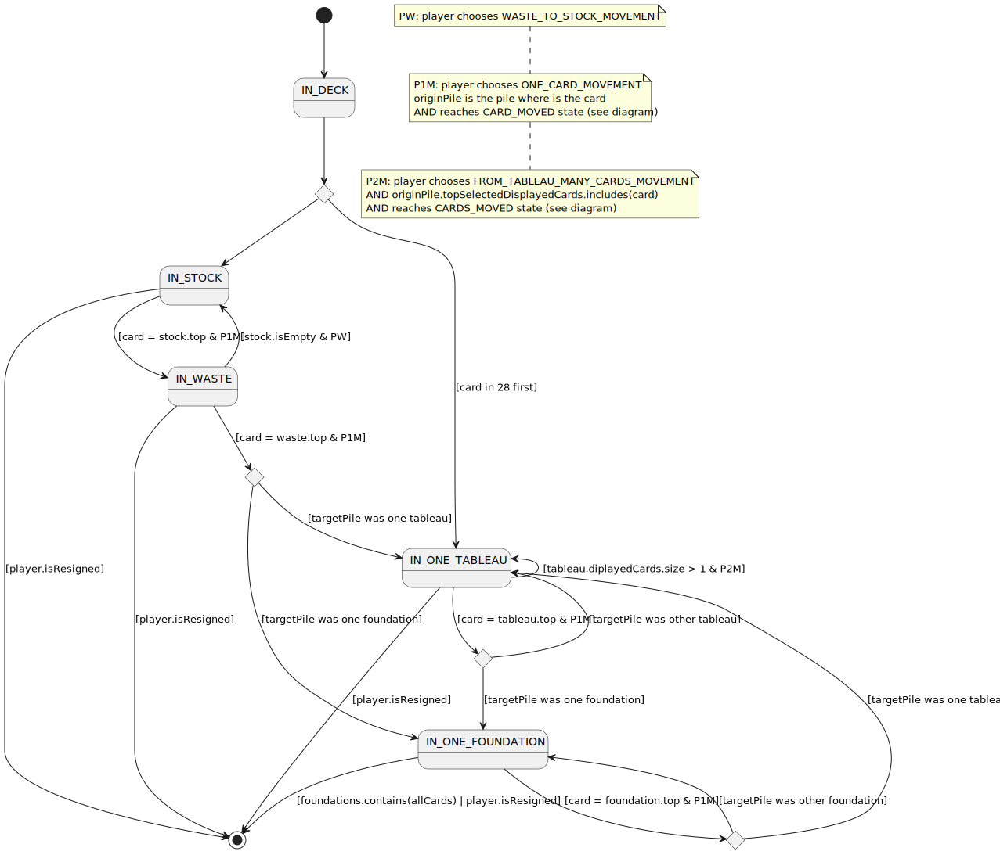

# Klondike
Project developed during [master of programming and software design](https://escuela.it/masters/master-programacion-diseno-software).

## index

* [domainModel](#domainModel)
    * [vocabulary](#vocabulary)
    * [vocabulary events](#vocabularyEvents)
    * [initialState](#initialState)
    * [finalState](#finalState)
    * [instructions](#instructions)
    * [card lifecycle](#card-lifecycle)
## domainModel

[WIKI](https://es.wikipedia.org/wiki/Solitario_de_cartas)

[Youtube](https://www.youtube.com/watch?v=yjgQXcFVBQY)
### vocabulary

### vocabularyEvents

### initialState

### finalState

### instructions

- Waste to stock movement
  

- One card movement
  

- Many cards movement from tableau
  

### card lifecycle

